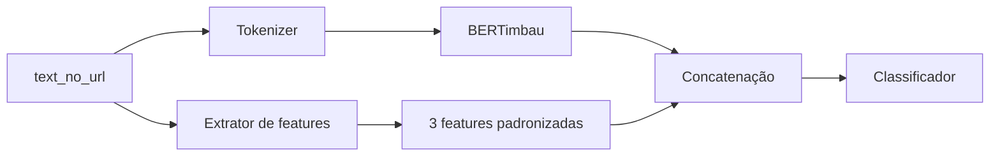

# Integrar features textuais ao BERT

## Escopo

- Atualizar `organizado/prepare_data/prepare.py` para gerar três colunas novas no parquet:
  `avg_sentence_words`, `emoji_count` e `spelling_error_rate`.
- Usar `language_tool_python` localmente, com `pt-BR`/`pt-PT` conforme a variante
  do texto, contando apenas matches de erro ortográfico e normalizando pela
  quantidade de palavras.
- Manter `models/v6/prepare_v6.py` sincronizado, pois `--prepare` atualmente o
  utiliza.

## Integração no treinamento

- Alterar `organizado/train/train_bertimbau_v6.py` com uma flag
  `--extra-features`, mantendo o comportamento text-only quando ela não for
  usada.
- Estender dataset, collators, inferência e predição para transportar as três
  features junto dos tokens.
- Padronizar as features usando somente estatísticas do conjunto `train` e
  salvar nomes, médias, escalas e versão do extrator nos artefatos.
- Criar um ramo numérico pequeno, concatená-lo à representação do BERT e usar
  um novo classificador binário compatível com checkpoints próprios.
- Preservar o suporte MPS com atenção `eager`, CUDA/CPU e tqdm.

## Verificação e execução

- Adicionar uma mensagem de erro clara caso `language_tool_python` não esteja
  instalado. A instalação necessária será:

  ```bash
  python3 -m pip install language-tool-python
  ```

- Regenerar os parquets de `organizado/prepare_data/processed/`, validar as
  novas colunas e executar um smoke test.
- Criar uma nova pasta de artefatos para o modelo com features. O checkpoint
  atual não será sobrescrito nem retomado diretamente, pois a arquitetura
  mudará.
- Validar o forward, o resume do novo formato e as métricas finais por grupo e
  calibração.

## Fluxo


